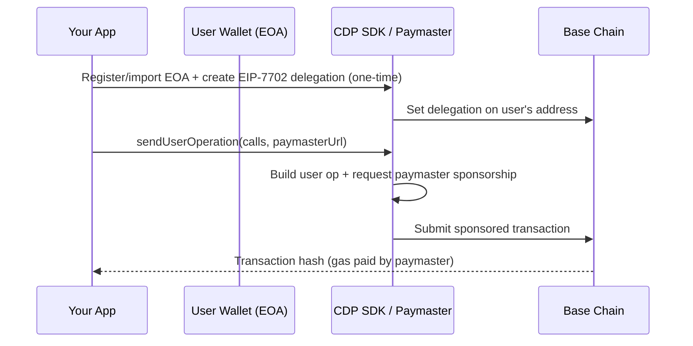

# Gas Sponsorship with EIP-7702 and CDP Paymaster

This document explains how ChamaPay sponsors gas for onchain transactions on **Base mainnet**, and how to reuse the same approach in another project — including sending **USDC from a MetaMask-connected wallet** without the user paying ETH for gas.

ChamaPay uses two complementary pieces:

1. **EIP-7702** — temporarily upgrades a normal EOA (externally owned account) so it can behave like a smart account for a transaction, **without changing the user's address**.
2. **Coinbase Developer Platform (CDP) Paymaster** — an ERC-7677-compliant service that pays gas on behalf of the user, subject to your allowlist and policy rules.

> **Note:** "CDP" = Coinbase Developer Platform. Some docs or conversations refer to it as "CPD"; they mean the same thing.

---

## How it works (high level)



**Key insight:** The user's address stays the same (`0xabc...`). EIP-7702 adds smart-account execution logic for that transaction. The CDP paymaster covers the ETH gas cost.

---

## Architecture in ChamaPay

ChamaPay runs on **Base mainnet** (`chainId: 8453`) and sponsors gas for:

- USDC transfers (`transfer`, `approve`)
- ChamaPay contract interactions (`registerChama`, `depositCash`, etc.)
- Batched calls (e.g. transfer + fee in one user operation)

### Relevant files

| File | Purpose |
|------|---------|
| `Server/Blockchain/CDPEIP7702Client.ts` | Core EIP-7702 + CDP paymaster integration |
| `Server/Blockchain/Constants.ts` | USDC address, builder code suffix |
| `Server/Controllers/paymasterController.ts` | Paymaster RPC proxy (for client wallets) |
| `Server/Routes/paymasterRoutes.ts` | `POST /paymaster/rpc` endpoint |
| `Server/Lib/send.ts` | Example: sponsored USDC transfer |
| `Server/Blockchain/erc20Functions.ts` | USDC approve/transfer helpers |

---

## Prerequisites

### 1. CDP account and API keys

Sign up at [Coinbase Developer Platform](https://portal.cdp.coinbase.com/).

You need:

| Env variable | Where to get it |
|--------------|-----------------|
| `CDP_API_KEY_ID` | Portal → API Keys |
| `CDP_API_KEY_SECRET` | Portal → API Keys |
| `CDP_WALLET_SECRET` | Portal → Wallet Secret (or legacy `WALLET_SECRET`) |
| `COINBASE_PAYMASTER_URL` | Portal → **Onchain Tools → Paymaster** |

Example `.env` (from `Server/.env.example`):

```bash
COINBASE_PAYMASTER_URL=https://api.developer.coinbase.com/rpc/v1/base/your-api-key
CDP_API_KEY_ID=your-api-key-id
CDP_API_KEY_SECRET=your-api-key-secret
CDP_WALLET_SECRET=your-wallet-secret
```

### 2. Paymaster contract allowlist

In the CDP Portal, under **Paymaster → Configuration**, add contracts and function selectors you want to sponsor.

For USDC transfers on Base, allowlist:

- **Contract:** `0x833589fCD6eDb6E08f4c7C32D4f71b54bdA02913` (USDC on Base)
- **Functions:** `transfer(address,uint256)`, `approve(address,uint256)`, etc.

Without this allowlist, the paymaster will reject sponsorship even if your code is correct.

### 3. NPM dependencies (server-side)

```bash
npm install @coinbase/cdp-sdk viem ox
```

---

## Pattern A: Server-side (what ChamaPay uses)

Use this when your backend holds or can access the user's private key (e.g. embedded/custodial wallets created in-app).

### Step 1 — Import the EOA into CDP

CDP must know about the wallet before it can delegate it:

```typescript
const serverAccount = await cdp.evm.importAccount({
  privateKey,
  name: `myapp-${address.slice(2, 27)}`, // 2–36 chars, alphanumeric + hyphens
});
```

If the account already exists, fall back to `cdp.evm.getAccount({ address })`.

### Step 2 — Create EIP-7702 delegation (one-time per wallet)

This registers the EOA with CDP's smart-account implementation:

```typescript
const { delegationOperationId } = await cdp.evm.createEvmEip7702Delegation({
  address: serverAccount.address,
  network: "base",
  enableSpendPermissions: false,
});

await cdp.evm.waitForEvmEip7702DelegationOperationStatus({
  delegationOperationId,
});
```

After this, CDP treats the EOA as a **delegated smart account** via `toEvmDelegatedAccount(serverAccount)`.

### Step 3 — Send a sponsored user operation

Every transaction goes through `sendUserOperation` with the paymaster URL:

```typescript
const { userOpHash } = await delegated.sendUserOperation({
  network: "base",
  calls: [
    {
      to: USDCAddress,
      abi: erc20Abi,
      functionName: "transfer",
      args: [recipient, amountInWei],
    },
  ],
  paymasterUrl: process.env.COINBASE_PAYMASTER_URL,
  dataSuffix: builderCodeDataSuffix, // optional Builder Code attribution
});

const result = await delegated.waitForUserOperation({ userOpHash });
// result.transactionHash → onchain tx
```

ChamaPay wraps this in `createEIP7702SmartAccount()` (`CDPEIP7702Client.ts`), which returns a viem-like client with `writeContract()` and `sendTransaction()`.

### Example: sponsored USDC transfer (ChamaPay)

From `Server/Lib/send.ts`:

```typescript
const { smartAccountClient } = await createEIP7702SmartAccount(privateKey);

const hash = await smartAccountClient.writeContract({
  address: USDCAddress,
  abi: erc20Abi,
  functionName: "transfer",
  args: [toAddress, parseUnits(amount, 6)],
  dataSuffix: builderCodeDataSuffix,
});
```

The user pays **USDC only** (the transfer amount). Gas is sponsored.

### Batched calls

You can batch multiple calls in one sponsored user operation:

```typescript
await smartAccountClient.sendTransaction({
  calls: [
    { to: USDCAddress, data: encodeTransfer(recipient, amount) },
    { to: USDCAddress, data: encodeTransfer(treasury, fee) },
  ],
});
```

See `Server/Blockchain/erc20Functions.ts` → `transferWithFeeTx`.

---

## Pattern B: Client-side with MetaMask (for your next project)

Use this when the user connects **their own wallet** (MetaMask, Coinbase Wallet, Base Account, etc.) and you **do not** have their private key on the server.

MetaMask and other modern wallets support [EIP-5792](https://eips.ethereum.org/EIPS/eip-5792) (`wallet_sendCalls`) and can request gas sponsorship via the `paymasterService` capability.

### Step 1 — Proxy the paymaster URL (required)

**Never expose `COINBASE_PAYMASTER_URL` in frontend code.** ChamaPay proxies it:

```
POST /paymaster/rpc  →  forwards JSON-RPC body to COINBASE_PAYMASTER_URL
```

Implementation: `Server/Controllers/paymasterController.ts`

```typescript
// Client calls: https://your-api.com/paymaster/rpc
// Server forwards to: https://api.developer.coinbase.com/rpc/v1/base/...
```

The paymaster speaks ERC-7677 JSON-RPC (`pm_getPaymasterStubData`, `pm_getPaymasterData`, etc.). The wallet handles this automatically when you pass the proxy URL.

### Step 2 — Check wallet capabilities

Before sending, verify the connected wallet supports paymaster sponsorship on Base:

```typescript
const capabilities = await window.ethereum.request({
  method: "wallet_getCapabilities",
  params: [userAddress],
});

const baseCapabilities = capabilities["0x2105"]; // Base mainnet = 8453 = 0x2105

const supportsPaymaster =
  baseCapabilities?.paymasterService?.supported === true;
```

If `supportsPaymaster` is false, fall back to a normal (user-paid gas) transaction or prompt the user to use a compatible wallet.

### Step 3 — Send sponsored USDC via `wallet_sendCalls`

```typescript
import { encodeFunctionData, parseUnits, numberToHex } from "viem";

const USDC_BASE = "0x833589fCD6eDb6E08f4c7C32D4f71b54bdA02913";
const BASE_CHAIN_ID = 8453; // 0x2105

const transferData = encodeFunctionData({
  abi: erc20Abi,
  functionName: "transfer",
  args: [recipientAddress, parseUnits("10", 6)], // 10 USDC
});

const result = await window.ethereum.request({
  method: "wallet_sendCalls",
  params: [
    {
      version: "1.0",
      chainId: numberToHex(BASE_CHAIN_ID),
      from: userAddress,
      calls: [
        {
          to: USDC_BASE,
          value: "0x0",
          data: transferData,
        },
      ],
      capabilities: {
        paymasterService: {
          url: "https://your-api.com/paymaster/rpc", // your proxy, NOT the raw CDP URL
        },
      },
    },
  ],
});

// Poll status with wallet_getCallsStatus if needed
console.log("Batch ID:", result);
```

### Step 4 — Wait for confirmation

```typescript
const status = await window.ethereum.request({
  method: "wallet_getCallsStatus",
  params: [result.id], // batch ID from wallet_sendCalls
});
```

### Wagmi integration (optional)

If you use wagmi v2, the same flow maps to `useSendCalls` + `useCapabilities`:

```typescript
import { useSendCalls, useCapabilities, useAccount } from "wagmi";
import { base } from "wagmi/chains";

const { data: capabilities } = useCapabilities();
const supportsPaymaster =
  capabilities?.[base.id]?.paymasterService?.supported === true;

const { sendCalls } = useSendCalls();

sendCalls({
  calls: [{ to: USDC_BASE, data: transferData, value: 0n }],
  chainId: base.id,
  capabilities: supportsPaymaster
    ? { paymasterService: { url: PAYMASTER_PROXY_URL } }
    : undefined,
});
```

See [Base docs: Paymasters](https://docs.base.org/base-account/improve-ux/sponsor-gas/paymasters) and [Wagmi batch transactions](https://docs.base.org/base-account/framework-integrations/wagmi/batch-transactions).

---

## MetaMask-specific notes

| Topic | Detail |
|-------|--------|
| **Network** | User must be on **Base** (chain ID 8453). Switch chains before sending. |
| **Wallet support** | Gas sponsorship requires `wallet_sendCalls` + `paymasterService`. Check with `wallet_getCapabilities`. Older MetaMask versions may not support this; users may need MetaMask with EIP-5792/EIP-7702 support or Coinbase Wallet / Base Account. |
| **EOA vs smart wallet** | Pattern B works with the user's connected address. The wallet + paymaster handle delegation and sponsorship internally. You do **not** call `createEvmEip7702Delegation` from the client. |
| **USDC balance** | Sponsored gas covers **ETH gas only**. The user still needs USDC in their wallet for the transfer itself. |
| **Allowlist** | CDP paymaster must allowlist USDC `transfer` on Base or sponsorship is denied. |

---

## Builder Codes (optional)

ChamaPay appends a [Builder Code](https://docs.base.org/apps/builder-codes/app-developers) to transactions for attribution on Base:

```typescript
import { Attribution } from "ox/erc8021";

const builderCodeDataSuffix = Attribution.toDataSuffix({
  codes: [process.env.BUILDER_CODE || "bc_b7k3p9da"],
});
```

Pass as `dataSuffix` in server-side user operations. For client-side `wallet_sendCalls`, append similarly if your wallet/SDK supports it.

---

## End-to-end checklist for a new MetaMask + USDC project

1. Create a CDP project and enable the **Base mainnet paymaster**.
2. Allowlist USDC (`0x833589...`) and the `transfer` selector in CDP Portal.
3. Add server env vars: `COINBASE_PAYMASTER_URL`, CDP API keys (needed only for Pattern A).
4. Implement `POST /paymaster/rpc` proxy on your backend.
5. Connect MetaMask to Base in your frontend.
6. Call `wallet_getCapabilities` → confirm `paymasterService.supported`.
7. Send USDC with `wallet_sendCalls` + `capabilities.paymasterService.url` pointing at your proxy.
8. Handle fallback when paymaster or capabilities are unavailable.

---

## Troubleshooting

| Symptom | Likely cause |
|---------|--------------|
| Paymaster rejects transaction | Contract/function not on CDP allowlist |
| `Paymaster URL is not configured` | Missing `COINBASE_PAYMASTER_URL` on server |
| `CDP_API_KEY_ID ... required` | Missing CDP credentials (Pattern A only) |
| `User operation failed` | Insufficient USDC, wrong network, or delegation not created |
| Wallet doesn't support paymaster | Use `wallet_getCapabilities`; upgrade wallet or use Pattern A |
| Gas still shown to user | Proxy URL not passed, or wallet doesn't support `paymasterService` |

---

## Constants (Base mainnet)

| Name | Value |
|------|-------|
| USDC | `0x833589fCD6eDb6E08f4c7C32D4f71b54bdA02913` |
| Chain ID | `8453` (`0x2105`) |
| USDC decimals | `6` |
| EIP-7702 implementation (reference) | `0xe6Cae83BdE06E4c305530e199D7217f42808555B` |

---

## Further reading

- [Base: Sponsor gas with Paymasters](https://docs.base.org/base-account/improve-ux/sponsor-gas/paymasters)
- [ERC-7677 Paymaster RPC](https://www.erc7677.xyz/)
- [EIP-5792: wallet_sendCalls](https://eips.ethereum.org/EIPS/eip-5792)
- [EIP-7702: Set EOA account code](https://eips.ethereum.org/EIPS/eip-7702)
- [CDP Paymaster docs](https://docs.cdp.coinbase.com/paymaster/introduction/welcome)
- [CDP SDK — smart accounts & Builder Codes](https://docs.cdp.coinbase.com/wallets/using-wallets/smart-accounts)
